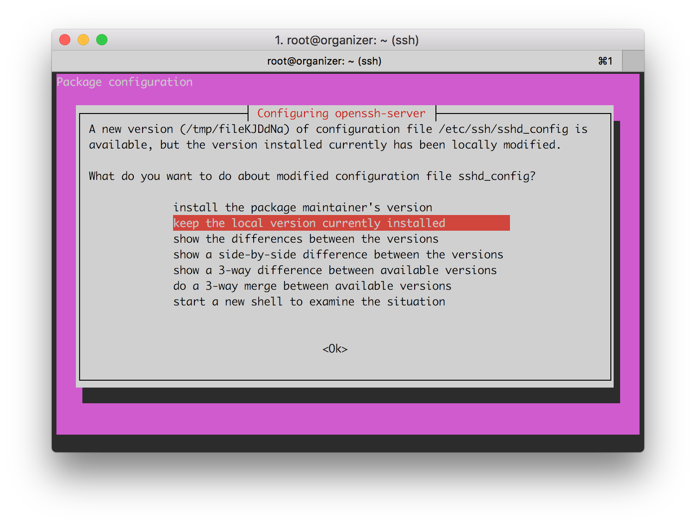
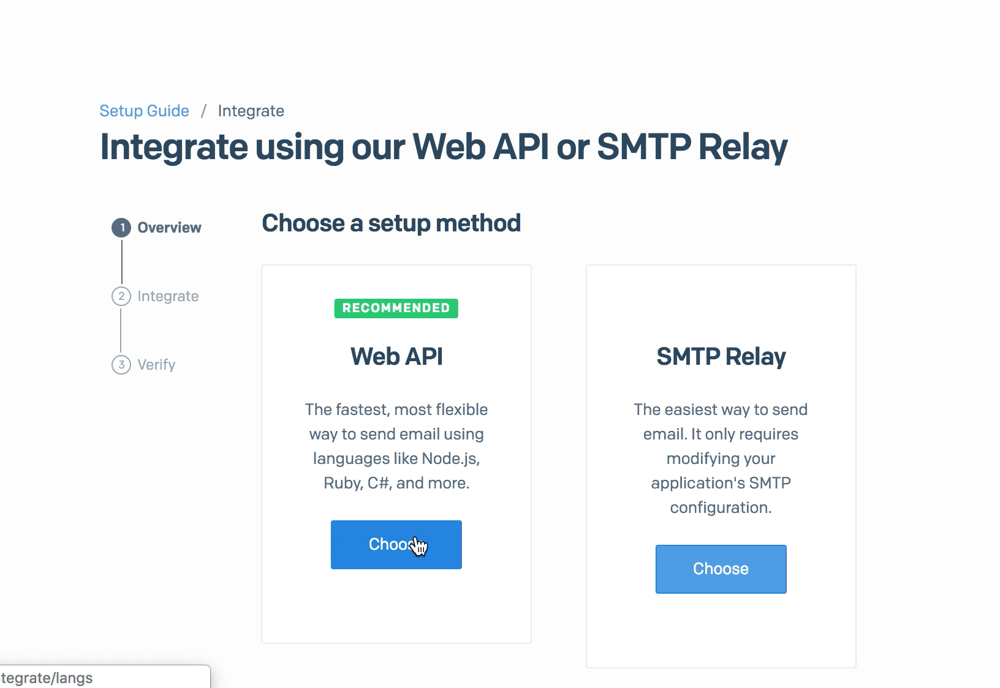
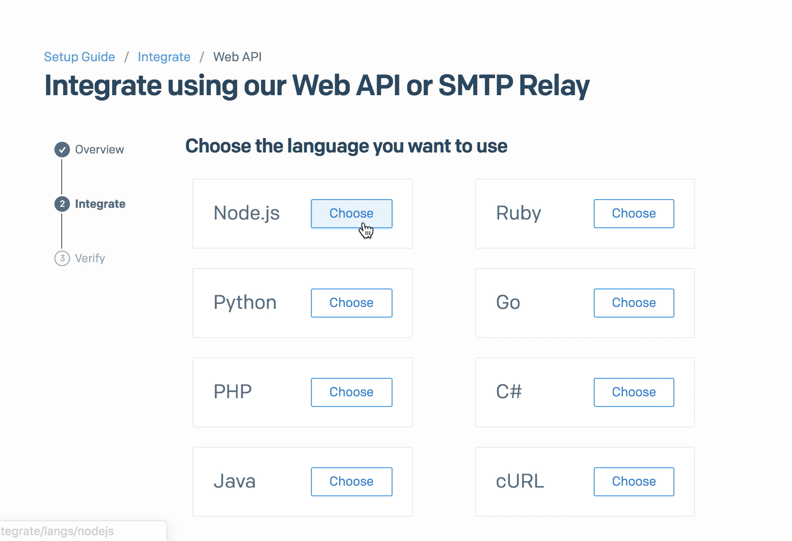
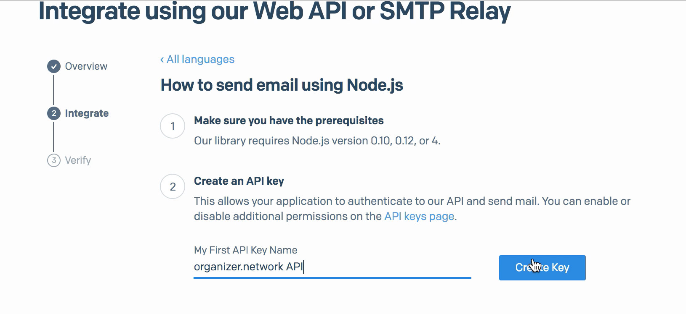

# Tutorial for setting up your own instance of organizer.network

organizer.network is a tool for organizers who might want to have more control over their tools and data. at its core it is open and decentralized messaging platform. the structure of organizer.net allows organizers to create private groups for their community, in order to exchange information.

The public version of the [organizer.network](https://organizer.network/) website is run on a [pm2](http://pm2.keymetrics.io/) behind an [nginx reverse proxy](https://docs.nginx.com/nginx/admin-guide/web-server/reverse-proxy/). Below you will find instructions for setting this up your own Digital Ocean server.

## Disclaimers
* This tutorial will be based on DigitalOcean. This is an easy to use service, but **it costs money**. You are welcome to use your preferred hosting service (and to make a small guide for it!)
* We also make use of [SendGrid](https://sendgrid.com), a free email service
* This tutorial relies heavily on the terminal

## Step One : setting up the server (using DigitalOcean)
* Create a [Digital Ocean](https://www.digitalocean.com/) account if you do not already have one.
* Create a new Ubuntu Droplet. The smallest size should be sufficient. The cheapest one is $5/mo if you keep it running constantly.
  * Create button -> Droplets
  * Choose an image -> Ubuntu
  * Choose a size -> $5/mo
  * You can skip past CPU optimized droplets, and the other options for now
  * (Optional) choose a data center region (pick on that is closes to you, or place that has privacy laws that best fit your needs)


* DigitalOcean will ask you to upload a **copy of your SSH public key**.
  * You can check to see if you already have a public key by running this in your terminal: `ls -al ~/.ssh`
  * You can create a new SSH key by following [this GitHub tutorial](https://help.github.com/articles/generating-a-new-ssh-key-and-adding-it-to-the-ssh-agent)
  * Copy the public key to your clipboard. Mac users can do this by running: `pbcopy < ~/.ssh/id_rsa.pub` 
  * And paste it into DigitalOcean


* Choose a hostname: if you have registered a domain name this is where you should put it.
* Give your droplet a name.


* Click Create button

## Step Two : configuring the server

* Copy the IP address for your new droplet, once it finishes booting.
* `$` `ssh root@[your ip address]`: to [SSH into your new machine as `root`](https://www.quora.com/What-does-it-mean-to-SSH-into-something).
* Accept the SSH key fingerprint by typing `yes`. You only need to do this once.

### System update
* `$` `apt update` : Update the system packages on your DigitalOcean instance. 
* `$` `apt upgrade -y` : Upgrade all of the packages. You might get a pink pop up screen warning you about updates. You can just press the enter key to select `keep the local version currently installed`

* `$` `apt install -y fail2ban` : install `fail2ban` to protect against SSH brute force attacks.

### New user and permissions
* `$` `adduser [username]` : to add yourself as a user. You can leave all of the contact information blank.
* `$` `mkdir /home/[username]/.ssh` : Create an ssh folder for your new user account.
* `$` `nano /home/[username]/.ssh/authorized_keys` : Opens the "nano" text editor in a new file called "autorized_keys"
* Open a new terminal tab/window
* `$` `pbcopy < ~/.ssh/id_rsa.pub` : This will copy the key
* Paste it on nano (the previous terminal tab/window)
* Save and quit (`ctrl-O`, `[enter]`, `ctrl-X`)
* `$` `chown -R [username]:[username] /home/[username]/.ssh` : Changes the ownership of the folder
* `$` `chmod 700 /home/[username]/.ssh` : Modifies the permissions of the folder
* `$` `chmod 600 /home/[username]/.ssh/authorized_keys` : Modifies the permissions of the specific file
* `$` `usermod -a -G sudo [username]` : Add your user to the `sudo` group.
* `$` `sudo reboot` : This will restart the system to complete the update and log you out

```
logout
Connection to [ip address] closed.
```


## Step three : install organizer.network
* `$` `ssh [username]@[ip address]` : Log back in as your user.

### Clone the repository
* `$` `sudo mkdir -p /var/www/organizer.network` : Create a folder for the application
* `$` ``sudo chown `whoami`:`whoami` /var/www/organizer.network`` : Change ownership of the new folder
* `$` `cd /var/www/organizer.network` : Go to the new folder
* `$` `git clone https://github.com/organizer-network/organizer.network.git .` : Clone the repository into the new folder

### Install the packages
* `$` `cd setup` : Go to the setup folder
* `$` `./ubuntu_setup.sh` : Run the setup script

### Configure the application

Before running these steps, you need to have a [SendGrid](https://sendgrid.com/) account and get an API key for the Web.
1. 
2. 
3. 

Now, back on the terminal:
* `$` `cd ..` : Go back to the main folder
* `$` `nano config.js` : To edit the configuration file
  * Replace `base_url` with the IP address of your instance `http://[ip address]`
  * Replace the `email_from` credentials with your name and your email address
  * Open a new terminal tab/window
  * `$` `openssl rand -hex 24` : This creates a random hash
  * Copy the hash
  * Go back to nano window and paste the hash inside the quotes after `session_secret:`
  * Paste SendGrid API key inside quotes after `sendgrid_api_key:`
  * Remove the comments (`//`) at the beginning of the line
* Save and quit (`ctrl-O`, `[enter]`, `ctrl-X`).

* `$` `pm2 start` : Start server


Now you're ready to roll. 

Go to **http://[ip address]** and start organizing!


## Troubleshooting
* SSH keys will only "just work" if you use the default `id_rsa` key name. Otherwise you'll need to set a `-i ~/.ssh/[your private key]` argument for the `ssh` command.
* For future maintenance flexibility, you may want to add a separate `deploy` user at this point and set up your server from that account. We'll continue with a standard user account.
* For some reason my `~/.config` folder had `root` file permissions, so I had to do the following in order to `git pull` successfully: `sudo chown -R dphiffer:dphiffer ~/.config`
