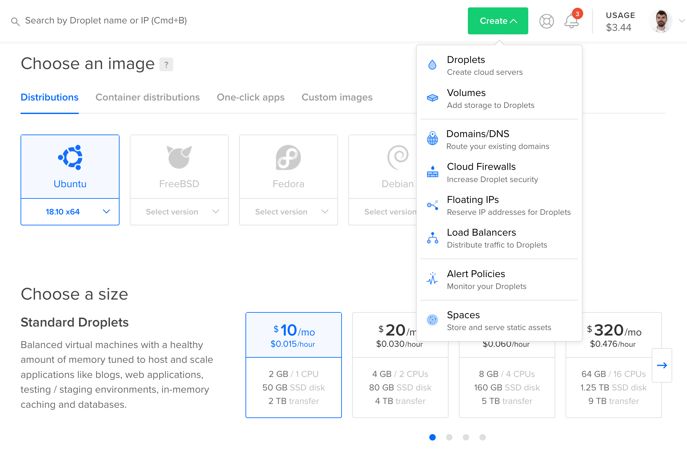
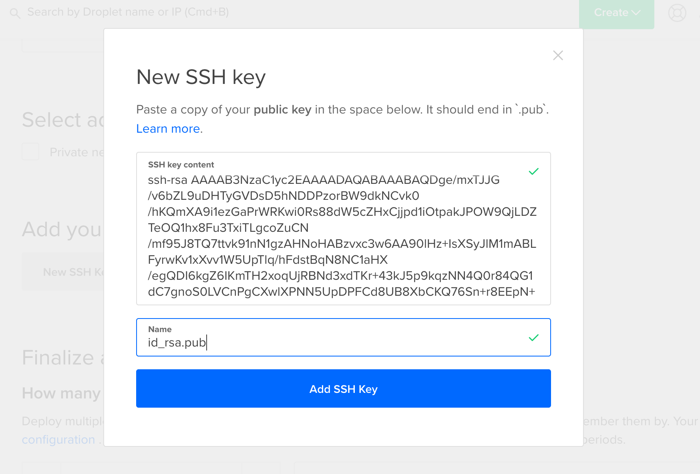
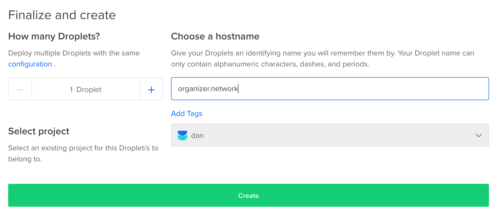

I've been running the public [organizer.network](https://organizer.network/) website on [pm2](http://pm2.keymetrics.io/) behind an [nginx reverse proxy](https://docs.nginx.com/nginx/admin-guide/web-server/reverse-proxy/). Digital Ocean has [a tutorial](https://www.digitalocean.com/community/tutorials/how-to-set-up-a-node-js-application-for-production-on-ubuntu-16-04) that might be worth looking at.

I'll describe the specific setup process here as a reference.

* Create a new Ubuntu 18.10 Droplet on [Digital Ocean](https://www.digitalocean.com/) (or on your preferred hosting provider). The smallest size should be sufficient.



* Copy/paste your a SSH public key.



* Give your droplet a name.



* Copy the IP address for your new droplet, once it finishes booting.
* SSH into your new machine as `root`.

```
$ ssh root@[your ip address]
```

Note: SSH keys will only "just work" if you use the default `id_rsa` key name. Otherwise you'll need to set a `-i ~/.ssh/[your private key]` argument for the `ssh` command.

* Make sure the system software is up-to-date, and install `fail2ban` to protect against SSH brute force attacks.

```
$ apt update
$ apt upgrade -y
$ apt install -y fail2ban
```

* Add a user for yourself (set a password, add whatever contact info you want to).

```
$ adduser [username]
```

* Add a public key to your user account.

```
$ mkdir /home/[username]/.ssh
$ nano /home/[username]/.ssh/authorized_keys
```

Paste in the contents of your public key, then save and quit (ctrl-O, [enter], ctrl-X).

* Set the file permissions.

```
$ chown -R [username]:[username] /home/[username]/.ssh
$ chmod 700 /home/[username]/.ssh
$ chmod 600 /home/[username]/.ssh/authorized_keys
```

* Add your user to the `sudo` group.

```
$ usermod -a -G sudo [username]
```

* Logout, then log back in as your user.

```
$ exit
logout
Connection to [ip address] closed.
$ ssh [username]@[ip address]
```

Note: for future maintenance flexibility, you may want to add a separate `deploy` user at this point and set up your server from that account. We'll continue with a standard user account.

* Clone the code repository.

```
$ sudo mkdir -p /var/www/organizer.network
$ sudo chown `whoami`:`whoami` /var/www/organizer.network
$ cd /var/www/organizer.network
$ git clone https://github.com/organizer-network/organizer.network.git .
```

* Run the setup script.

```
$ cd setup
$ sudo ./ubuntu_setup.sh
```
